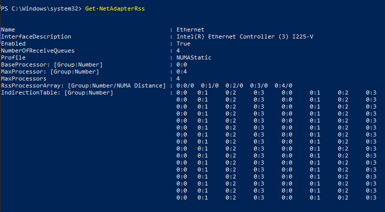

## Network
### Intel Interrupt Moderation
#### Q: Does interrupt moderation rate have an effect on deferred procedure call (DPC) or interrupt service routine (ISR) latency, and what are the key differences between each of the settings?
Yes, during the simulations it was found that it had more of an impact on DPC latency processing times over ISR, however each setting didn't scale equally as higher interrupt moderation values were used however this may be dependant other factors such as RSS, RSS affinity, rx/tx buffers, and timer resolution and the traffic simulation itself.

<details>
 <summary><ins>Findings and Analysis</ins></summary>

**Configuration during the tests**
  * Tools: xperf & iperf
  * Windows 10 1909
  * PCI-E Network Adapter (Intel Gigabit Desktop CT)
  * Driver: Microsoft, 2018-06-12, 12.17.10.8
  * MSI Mode
  * RSS Enabled, 2 RSS on cores 3 & 4, NUMAStatic
  * RX & TX buffer 768
  * Adapter Power Savings Off
  * Default Timer Resolution: 15.6ms
  * 30sec simulation +900Mbps, TCP, 100MB transfers, no fragmentation

**Interrupts and DPC stats by mode**

**Extreme = 92,000**
  * Avg NDIS DPC Performance
  * 22% <= 8 usecs
  * 46% <= 16 usecs
  * 20% <= 32 usecs

**High = 115,000**
  * Avg NDIS DPC Performance
  * 2% <= 1 usecs
  * 7% <= 2 usecs
  * 31% <= 8 usecs
  * 46% <= 16 usecs
  * 11% <= 32 usecs

**Medium = 180,000**
  * Avg NDIS DPC Performance
  * 30% <= 1 usecs
  * 22% <= 4 usecs
  * 34% <= 16 usecs

**Adaptive = 200,000**
  * Avg NDIS DPC Performance
  * 6% <= 1 usecs
  * 22% <= 2 usecs
  * 41% <= 4 usecs
  * 24% <= 16 usecs

**Low = 340,000**
  * Avg NDIS DPC Performance
  * 23% <= 2 usecs
  * 55% <= 8 usecs

**Minimal = 640,000**
  * Avg NDIS DPC Performance
  * 49% <= 2 usecs
  * 8% <= 4 usecs
  * 34% <= 8 usecs

**Off (but Interrupt Moderation Enabled) = 2,650,000**
  * Avg NDIS DPC Performance
  * 27% <= 1 usecs
  * 58% <= 2 usecs
  * 8% <= 8 usecs

**Observations**
  * Interrupt Moderation Disabled produced the same numbers as with **Enabled but Off**
  * NDIS dpc latency spread (across cores) isn't always equally balanced between runs
but DPC latency performance does not change regardless
  * DPC latency in general is consistent between runs
  * The gap between Off and the next least restrictive setting (minimal) is very significant
  * The proper ordering of these settings from **least to most** interrupt requests are:
    * Extreme > High > Medium > Adaptive (Also dependent on load) > Low > Minimal > Off/Disabled
  * Overall **Medium** seemed to have the least impact on user experience/gaming while still providing low DPC latency. A very low DPC latency can still be achieved with a medium interrupt moderation value in which DPCs are processed 90% equal to or below 1 usecs for high volume small packet UDP communications (gaming).
</details></br>

### NetworkThrottlingIndex
#### Q: Disabling NetworkThrottlingIndex feature improves overall network performance and latency
Not completely true, NDIS.sys DPC latency is increased quite notably when disabled.

<details><summary><ins>Findings and Analysis</ins></summary>

* A very common recommendation in many performance enhancement/gaming guides state that disabling *NetworkThrottleIndex* improves network performance and latency because in theory it should prevent rate limiting and quality of service (QoS) interactions. 
* The main purpose of NetworkThrottlingIndex is to reduce (rate limit) calls which would otherwise impact real time audio and perhaps cause stutter or other audible artifacts.
* Disabling it may increase **throughput** should the throughput exceed the default receiving packets per millisecond (ppms) limit (NetworkThrottleIndex: 10 decimal, 10 packets per millisecond, 10,000 received packets per second which is roughly ~ 15Mbps with 1500byte Ethernet MTU) but it does not improve DPC latency which is probably more beneficial for lower latency applications such as video games.
* It's unclear why DPC processing latency is much lower when this feature is enabled even when you're not reaching the inbound receive rate limit in comparison to disabling the feature completely which removes any throttling.
* To learn mouse about Network Throttling Index see the [Technical References](../../TECHNICAL%20REFERENCES/README.md) article **Multimedia Class Scheduler Service (MMCSS) Vista Multimedia Playback and Network Throughput** written by Mark Russinovich.

* You can test this for yourself using **xperf**, start a capture for **dpcisr** and compare the results of both for **NDIS.sys**. 
* **Registry Path:** 
```
    HKEY_LOCAL_MACHINE\SOFTWARE\Microsoft\Windows NT\CurrentVersion\Multimedia\SystemProfile\NetworkThrottlingIndex
    Off: DWORD Value 0xFFFFFFFF (Hex)
    On: DWORD Value 10 (Decimal), Default - Range: Decimal 1-70
``` 

  * You should see a similar result as below during load such as gameplay. **Note:** **Intel** tends to be closer to **<= 1-2 usecs (microseconds)** where as **Realtek** is much higher, around with some around **<= 32 usecs** and **most <= 4 usecs** when most network optimizations are applied.
  
  * **Intel**
    * **Disabled**, 0xFFFFFFFF
    
    
    * **Enabled**, Decimal 10
    
    
    
</details></br>

### Receive Side Scaling (RSS)
#### Q: My onboard network adapter (I225-V) supports RSS, MSI and MSI-X but why is my indirection table missing that gives proper support for RSS in Microsoft Windows?
This seems to be a failure on either your motherboard manufacturers part or Intel, or both (my situation -> MSI MPG Z690 EDGE WIFI DDR4). Similar may be occuring with other network adapters. All current drivers (.inf) across many official driver releases for I-225V don't properly set the necessary registry keys required for RSS in NDIS 6.X or later so that the indirection table is available.

This finding and credit is inspired by this authors post for Windows servers https://community.spiceworks.com/topic/2282473-the-real-disaster-behind-the-network-performance-disaster-with-server-2019

To learn more see findings and analysis below.

<details><summary><ins>Findings and Analysis</ins></summary>

#### Getting the RSS Indirection Table to Populate (if supported)
1. Determine if your networ adapter supports RSS, MSI and MSI-X.
   * Search for your network adapter support documentation e.g. Intel I-255V product page. 
      * https://www.intel.com/content/www/us/en/products/sku/184676/intel-ethernet-controller-i225v/specifications.html
      * Legacy and Message Signal Interrupt (MSI) = Interrupt mapping.
      * Message Signal Interrupt Extension (MSI-X) = Dynamic allocation of up to 5 vectors per port
      * etc
2. Ensure RSS and TaskOffload is enabled on the Windows side
   * Open Powershell.exe as admin and run the following commands
```
View Settings
> netsh int tcp show global | findstr Receive-Side 
> netsh int ip show global | findstr Offload
or
> get-netoffloadglobalsetting

Enable Settings
> netsh int tcp set global rss=enabled
> netsh int ip set global taskoffload=enabled
or
> set-netoffloadglobalsetting -TaskOffload Enabled
> set-netoffloadglobalsetting -ReceiveSideScaling Enabled
```
3. Add the required network adapter RSS registry keys
   *  Registry Path: ```HKEY_LOCAL_MACHINE\SYSTEM\CurrentControlSet\Control\Class\{4d36e972-e325-11ce-bfc1-08002be10318}\<YOURADAPTER>\```
   *  In each numbered folder look for the one that matches your network card. e.g. DriverDesc = Intel(R) Ethernet Controller (3) I225-V
```
Windows Registry Editor Version 5.00

[HKEY_LOCAL_MACHINE\SYSTEM\CurrentControlSet\Control\Class\{4d36e972-e325-11ce-bfc1-08002be10318}\0009]
"*NumRssQueues"="4"
"*RSS"="1"
"*RSSProfile"="4"
"*RssBaseProcNumber"="0"
"*MaxRssProcessors"="4"
"*NumaNodeId"="0"
"*RssBaseProcGroup"="0"
"*RssMaxProcNumber"="4"
"*RssMaxProcGroup"="0"
```
   * These can be verified and adjusted with ```Get-NetAdapterRSS and Set-NetAdapterRSS *``` commands.

#### What Went Wrong in the Driver Installation (.inf)?
1. Let's look at the inf file "PRO2500\Winx64\NDIS68\e2f68.inf"
   * Let's find our network adapter id to determine what is loaded from the inf.
      * Device Manager > Network Adapters > Right Click "Intel(R) Ethernet Controller (3) I225-V" > Details > Matching device Id > Right click > Copy. e.g. PCI\VEN_8086&DEV_15F3&REV_03
   * Open the .inf in notepad and CTRL-F (find) the Device ID string you copied, this should take you to the first section with "DisplayName, Section and DeviceID"
   * Copy the "Section" value referenced with your Device ID. e.g. in my case E15F3_3.10.0.1..17763
   * Use CTRL-F (find) again to find the Section you copied.
   * Now you can see all the other "Inf Sections" that are executed and registry changes that are applied for your network adapters driver installation such as RSS.reg, RSS4Q.reg. CTRL-F + RSS.reg.
```
;------------------------------------------------------------------------------
; Intel(R) Ethernet Controller (3) I225-V
;------------------------------------------------------------------------------
[E15F3_3.10.0.1..17763]
Characteristics           = 0x84 ; NCF_HAS_UI | NCF_PHYSICAL
BusType                   = 5    ; PCI
DelReg                    = Advanced.DelReg
[...]
AddReg                    = RSS.reg, RSS4Q.reg
```
   * Now look at RSS.reg and RSS4Q section (in my case), these are the only values added to registry for my network adapter.
```
[RSS.reg]
; *RSS

[RSS4Q.reg]
; NumRssQueues
HKR, Ndi\Params\*NumRssQueues,                           ParamDesc,              0, %NumRssQueues2%
HKR, Ndi\Params\*NumRssQueues,                           default,                0, "4"
HKR, Ndi\Params\*NumRssQueues,                           type,                   0, "enum"
HKR, Ndi\Params\*NumRssQueues\Enum,                      "1",                    0, %1queue%
HKR, Ndi\Params\*NumRssQueues\Enum,                      "2",                    0, %2queues%
HKR, Ndi\Params\*NumRssQueues\Enum,                      "4",                    0, %4queues%
```
   * If you look around a bit you'll notice other network adapters get additional RSS sections added, in my case "RSSAdvanced.reg" which adds the following. Look familiar?
```
[RSSAdvanced.reg]
; *MaxRssProcessors
HKR, Ndi\Params\*MaxRssProcessors,                      ParamDesc,              0, %MaxRssProcessors%
HKR, Ndi\Params\*MaxRssProcessors,                      default,                0, "8"
HKR, Ndi\Params\*MaxRssProcessors,                      type,                   0, "enum"
HKR, Ndi\Params\*MaxRssProcessors\Enum,                 "1",                    0, "1"
HKR, Ndi\Params\*MaxRssProcessors\Enum,                 "2",                    0, "2"
HKR, Ndi\Params\*MaxRssProcessors\Enum,                 "4",                    0, "4"
HKR, Ndi\Params\*MaxRssProcessors\Enum,                 "8",                    0, "8"

; *RssBaseProcNumber
HKR, Ndi\params\*RssBaseProcNumber,                     ParamDesc,              0, %RssBaseProcNumber%
HKR, Ndi\params\*RssBaseProcNumber,                     default,                0, "0"
HKR, Ndi\params\*RssBaseProcNumber,                     min,                    0, "0"
HKR, Ndi\params\*RssBaseProcNumber,                     max,                    0, "63"
HKR, Ndi\params\*RssBaseProcNumber,                     step,                   0, "1"
HKR, Ndi\params\*RssBaseProcNumber,                     Optional,               0, "0"
HKR, Ndi\params\*RssBaseProcNumber,                     type,                   0, "int"

; *NumaNodeId
HKR, Ndi\params\*NumaNodeId,                            ParamDesc,              0, %NumaNodeId%
HKR, Ndi\params\*NumaNodeId,                            default,                0, "65535"
HKR, Ndi\params\*NumaNodeId,                            type,                   0, "dword"
HKR, Ndi\params\*NumaNodeId,                            min,                    0, "0"
HKR, Ndi\params\*NumaNodeId,                            max,                    0, "65535"
HKR, Ndi\params\*NumaNodeId,                            step,                   0, "1"

; *RSSProfile
HKR, Ndi\Params\*RSSProfile,                            ParamDesc,              0, %RSSProfile%
HKR, Ndi\Params\*RSSProfile,                            default,                0, "1"
HKR, Ndi\Params\*RSSProfile,                            type,                   0, "enum"
HKR, Ndi\Params\*RSSProfile\Enum,                       "1",                    0, %Closest_Processor%
HKR, Ndi\Params\*RSSProfile\Enum,                       "2",                    0, %Closest_Processor_Static%
HKR, Ndi\Params\*RSSProfile\Enum,                       "3",                    0, %NUMA_Scaling%
HKR, Ndi\Params\*RSSProfile\Enum,                       "4",                    0, %NUMA_Scaling_Static%
HKR, Ndi\Params\*RSSProfile\Enum,                       "5",                    0, %Conservative_Scaling%
HKR,,                                                   *RSSProfile,            0, "1"
```
   * It seems like all that Intel or the motherboard manufacturer would probably need to do is create a custom .inf and resign the .cab file so that the adapter also uses [RSSAdvanced.reg]
``` AddReg                    = RSS.reg, RSS4Q.reg, RSSAdvanced.reg ```

#### Why can't we just edit the .inf, uninstall and reinstall the driver?
   * Windows checks that .inf files match the hashes from the "signed" .cab file, if there are discrepancies it'll block it by default. This is a good thing for system security.

#### I225-V Indirection Table on MSI MPG Z690 EDGE WIFI DDR4


#### Additional References
* https://docs.microsoft.com/de-de/windows-hardware/drivers/network/standardized-inf-keywords-for-rss
* https://learn.microsoft.com/en-us/windows-hardware/drivers/network/task-offload
* https://learn.microsoft.com/en-us/windows-hardware/drivers/network/using-registry-values-to-enable-and-disable-task-offloading
* https://www.overclock.net/threads/registry-setting-disabletaskoffload-rss-and-indirection-table.1752848/

</details></br>
