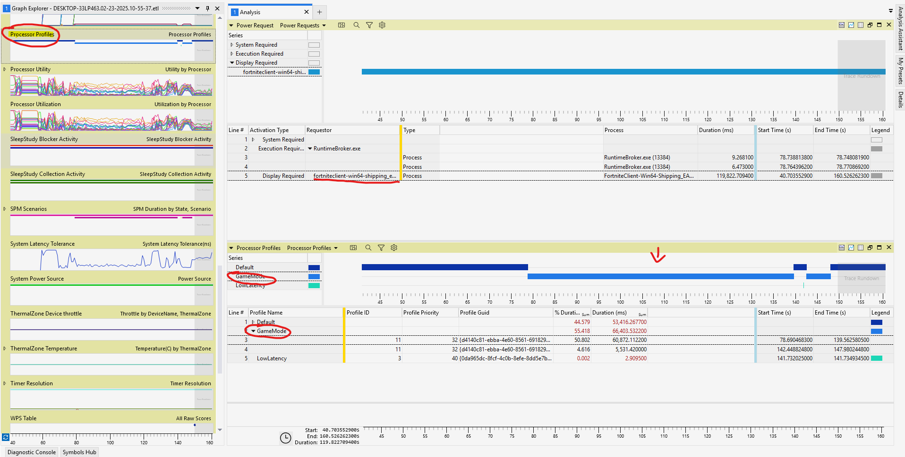

## Windows Power Settings
### Power Plans
#### Q: What are the differences between the Windows Power Plans and their hidden settings?
The best way is to compare for yourself, there are several power plan management tools available for download online. I've also provided a basic powershell script that will switch between each power plan then export the data in a CSV format using Windows built-in power management tool powercfg.exe, see below for more information.

A complete list of default values extracted from built-in power plans on Windows 10 2019 LTSC:
* [PowerPlanSettingsCompare.csv](../FINDINGS/PowerPlanSettingsCompare.csv)

A script that enumerates all power plan settings and exports it to CSV:
* [PowerPlantoCSV.ps1](../../SCRIPTS/PowerPlantoCSV.ps1)

### Power Features
#### Q: How can you determine if your application is switching Windows Game Mode on or off using Windows Performance Analyzer?
1. Start a Windows Performance Recorder (WPR) capture choosing the profile option Resource Analysis > Power Usage before you run your test e.g. running a specific game or application.
2. Complete your test
3. Stop the recording
2. Open the capture in Windows Performance Analyzer (WPA), expand the Power Section and load the Processor Profiles data.
4. Analyze the graph for Game Mode status changes.
   

<ins>Findings and Analysis</ins>

See the following screenshot 

 
