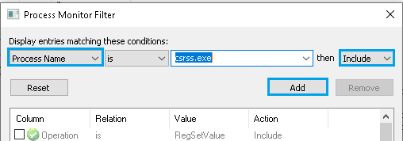

## Windows Registry
### Registry Keys and Values
#### Q: Is there an easy way to see what registry keys are accessed or modified by every process or dll upon execution or during runtime?
Yes, there are two relatively easy methods to check for this activity, Windows Sysinternals Process Monitor and Windows Performance Analyzer and Recorder. Windows Sysinternals Process Monitor is best used during realtime analysis, launching a process or restarting a service whereas Windows Performance Analyzer and Recorder also allows you to capture key information during the boot process.

<ins>Findings and Analysis</ins>

**Process Monitor**
1. Download Process Monitor - https://docs.microsoft.com/en-us/sysinternals/downloads/procmon
2. **Run as admin** and **press OK** to apply the default filter
3. In the navigation bar ensure that only **Show Registry Activity** button is selected.

4. Use the filtering options **Filter Menu -> Filter -> Add** to narrow down on the process of interest then **press OK**. You can also filter on the type of Registry I/O activity once you have a better idea of what you're looking for.

**Windows Performance Analyzer and Recorder**
1. Download Windows Assessment and Deployment Kit (Windows ADK) - https://docs.microsoft.com/en-us/windows-hardware/get-started/adk-install
2. Only **install Windows Performance Analyzer** toolset
3. Open Windows Performance Recorder, select **Performance Scenario: Boot**, or if you want to capture a realtime snapshot then just choose memory or disk. Memory is preferred for short lived performance recording scenarios and disk for longer recording sessions.
4. Expand **Resource Analysis** then ensure to select **Registry I/O Activity** and **if ready, press Start**

5. Once the restart process is complete **use Windows Performance Analyzer to review the recorded information**, use the builtin filtering options to limit by process or registry paths.

 

#### Q: What are some of the registry keys accessed on boot? Do they reveal potentially hidden registry keys and values?
There's a large amount of registry keys loaded on boot as the registry is intended to persist application and operating system configuration state between uses. There does appear to be many potentially hidden registry keys for drivers and operating system functions based on the attempted access patterns, however most of these are often without documentation so to prove there is any difference may require further research, performance analysis, trial and error. See findings and analysis for more details.

<ins>Findings and Analysis</ins>

  
* Using Windows Performance Analyzer and Recorder as described in [Is there an easy way to see what registry keys are accessed or modified?](https://github.com/djdallmann/GamingPCSetup/tree/master/CONTENT/RESEARCH/WINREGISTRY#q-is-there-an-easy-way-to-see-what-registry-keys-are-accessed-or-modified-by-every-process-or-dll-upon-execution-or-during-runtime), the following key value pairs were only some of the notable identified values during the boot process of my machine.
  * [AudioSrv](../FINDINGS/registrykeys_audiosrv.txt)
  * [Desktop Window Manager (dwm)](../FINDINGS/registrykeys_dwm.txt)
  * [Windows OS Supplementary Graphics Drivers Options](../FINDINGS/registrykeys_graphicsdrivers.txt)
  * [Display Adapter Class](../FINDINGS/registrykeys_displayadapter_class_4d36e968-e325-11ce-bfc1-08002be10318.txt)
  * [Network Adapter Class](../FINDINGS/registrykeys_networkadapter_class_4d36e972-e325-11ce-bfc1-08002be10318.txt)
  * [Keyboard Class](../FINDINGS/registrykeys_kbdclass.txt)
  * [Keyboard HID](../FINDINGS/registrykeys_kbdhid.txt)
  * [Mouse Class](../FINDINGS/registrykeys_mouclass.txt)
  * [Mouse HID](../FINDINGS/registrykeys_mouhid.txt)
  * [Kernel Velocity](../FINDINGS/registrykeys_kernelvelocity.txt)
  * [Multimedia Class Scheduler Service](../FINDINGS/registrykeys_mmcss.txt)
  * [NVIDIA Display Driver](../FINDINGS/registrykeys_nvlddmkm.txt)
  * [Storage AHCI](../FINDINGS/registrykeys_storahci.txt)
  * [Storage NVME](../FINDINGS/registrykeys_stornvme.txt)
  * [Storage TCPIP](../FINDINGS/registrykeys_tcpip.txt)
  * [Network Driver Interface Specification (NDIS)](../FINDINGS/registrykeys_ndis.txt)

 
